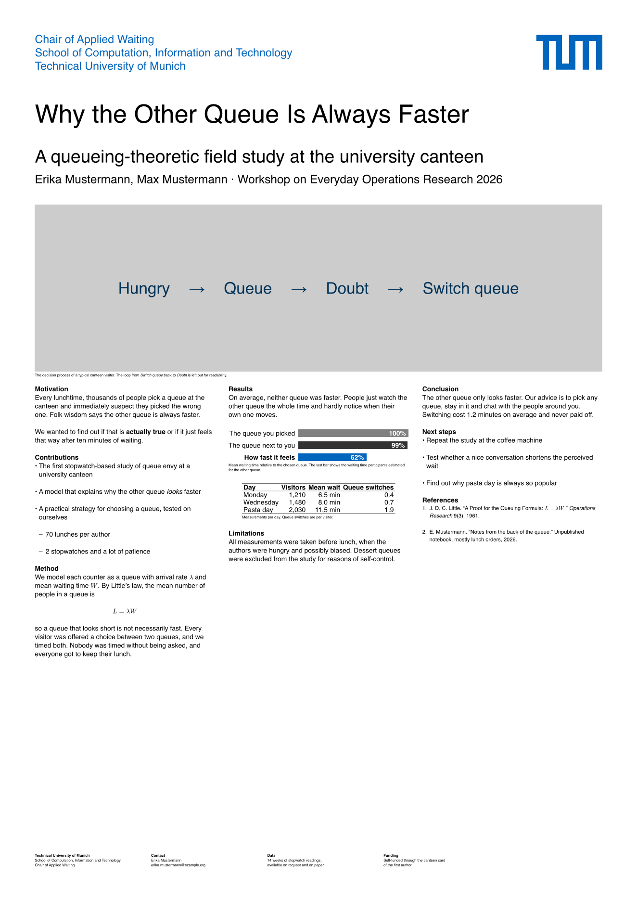
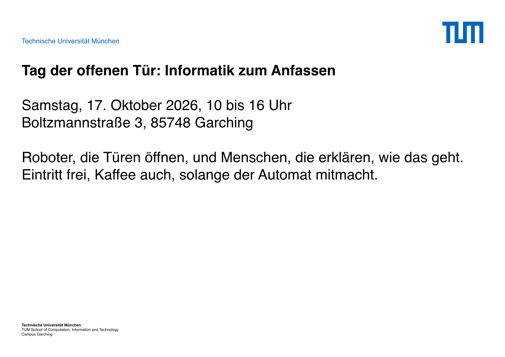

# typst-tum-poster

Posters in the corporate design of the Technical University of Munich (TUM),
ported from the official TUM LaTeX template package (`200805_TUM_LaTex-Vorlagenpaket`).

TUM has poster templates for A0, A1, A2, A3 and A4, each in portrait and
landscape, and this package supports the same ten formats. The size you pick
sets paper, margins, font sizes, logo, header, footer and column gutter to the
values from the matching LaTeX template. Other sizes fail with an error.

## Examples

| [Research poster](examples/research-poster.typ) (A0 portrait) | [Event notice](examples/event-poster.typ) (A3 landscape) |
| --- | --- |
|  |  |

The research poster has three columns, a figure across all of them, a chart,
a table, some math and a footer split into columns. The event notice copies
the official layout for posters with little text. It has no titles, a single
column in `large` text and just the university name in the header.

To build them:

```sh
typst compile --root . examples/research-poster.typ
typst compile --root . examples/event-poster.typ
```

## Usage

Start from [`template/main.typ`](template/main.typ):

```typ
#import "../lib.typ": poster

#show: poster.with(
  size: "a0",
  orientation: "portrait",
  title: [Heading 1],
  subtitle: [Heading 2],
  tagline: [Heading 3],
  faculty: [School of Computation, Information and Technology],
  chair: [Chair of Example Studies],
  footer: "sender",
)

= Section
Body text flows through the page columns.
```

```sh
typst compile template/main.typ --root .
```

### Options

| Parameter     | Default      | Description |
| ------------- | ------------ | ----------- |
| `size`        | `"a0"`       | `"a0"` to `"a4"`, case-insensitive. |
| `orientation` | `"portrait"` | `"portrait"` or `"landscape"`. |
| `title`, `subtitle`, `tagline` | `none` | The three title levels. They span the full page width. |
| `author`      | `()`         | Author(s) for the PDF metadata. |
| `university`  | `auto`       | University name in the language given by `lang`. |
| `faculty`, `chair` | `none`  | Shown in header and footer. |
| `header`      | `"full"`     | `"full"` (chair, faculty, university), `"university"` or `none` (logo only). |
| `footer`      | `none`       | `"sender"` (university, faculty, chair), an array of content that fills the footer column grid of the format, or any content. |
| `logo`        | `auto`       | `"blue"`, `"black"`, `"white"`, `none`, or your own content. |
| `columns`     | `auto`       | Number of body columns. `auto` picks a default per format. |
| `font`        | `("Helvetica", "Arial")` | Helvetica like the LaTeX templates, Arial if Helvetica is not installed. |
| `lang`        | `"de"`       | Text language. |

### Layout helpers

- `= Heading` gives the bold section headings of the official template.
- A figure that spans all columns:
  ```typ
  #place(top, scope: "parent", float: true, figure(
    image("photo.jpg", width: 100%),
    caption: [Caption, author],
  ))
  ```
- `#large[...]` sets text in the size of the main title. TUM suggests this
  for posters with little text. Use it together with `columns: 1`.
- `#colbreak()` starts the next column.
- `tum-colors` holds the colors of the TUM Corporate Design Manual, e.g.
  `tum-colors.primary-blue` or `tum-colors.accent-orange`. The accent colors
  are meant for highlights only, not for backgrounds.
- `poster-format(size, orientation)` gives you all measurements of a format if
  you want to build your own layout.

## How the layout was ported

The values in [`src/formats.typ`](src/formats.typ) come from
`Ressourcen/Plakat/A*.tex` and `Praeambel*.tex`. Title and body positions were
checked against the example PDFs of the LaTeX package and are within half a
millimetre of them.

The footer is placed differently on purpose. The LaTeX templates move it by a
different offset for every format, and the results don't line up. Here the
last footer line always sits on the bottom margin, which is what A0 and A4
portrait do in the original.

## Checking all formats

```sh
typst compile --root . tests/all-formats.typ
```

[`tests/all-formats.typ`](tests/all-formats.typ) renders one page per format,
so a single PDF shows all ten. [`tests/unsupported-size.typ`](tests/unsupported-size.typ)
uses A5 and has to fail. The GitHub Actions build both, plus the template and
the examples.

## License

The code is MIT licensed.

The TUM logos are not. The files in `assets/` (`tum-logo-blue.svg`,
`tum-logo-black.svg`, `tum-logo-white.svg`) come from the official TUM LaTeX
template package, converted to SVG. The logo is a trademark of the Technical
University of Munich and all rights stay with TUM. You may only use it as the
TUM corporate design guidelines allow (<https://www.tum.de/cd>), and the MIT
License does not give you any right to reuse, change or redistribute it. This
also goes for the logo in the example previews and the template thumbnail.
